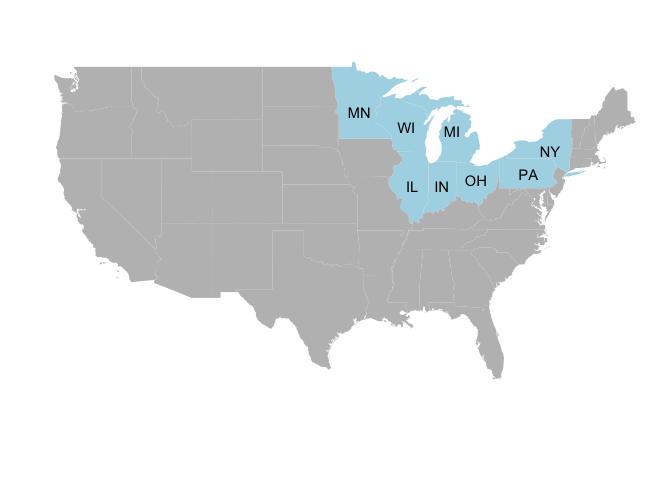

greatLakes
================
Wenlong
3/25/2018

谢邀 @云舞空城 @恒源祥 。

0. 前言
-------

美国五大湖流域是个非常大的区域，地形地貌涵盖了高山、平原、湖滩湿地等；土地利用类型也包括了农田、森林、湿地和城区；各个地区的气候类型也有一些差异。如果不考虑某些极端地区和特殊情况，作为种植业和畜牧业主产区之一，美国五大湖区的平原带土壤的肥力和生产力是非常可观的，不知道题主是从哪里得到的结论。 鉴于一句话的回答干货太少，笔者换一个问法：为什么在高强度的农业生产活动下，五大湖区土壤没有退化，依然保持了土壤肥力？

1. 五大湖区的地理位置
---------------------

美国五大湖区涵盖了美国八个州的全部或部分区域，其中明尼苏达(MN), 威斯康辛(WI), 密西根(MI), 伊利诺伊(IL), 印第安纳(IN), 和俄亥俄州(OH) 皆有大量的农业生产活动，本文就主要针对这几个州来讨论。

Fig. 1 美国五大湖区的地理位置

2. 五大湖区农业区的简介
-----------------------

美国五大湖区的农业非常发达， \#\# 3. 农业生产情况下保持土壤肥力的原因 \#\# 4. 对我国农业生产的启示 \#\# 5. Take-home points
