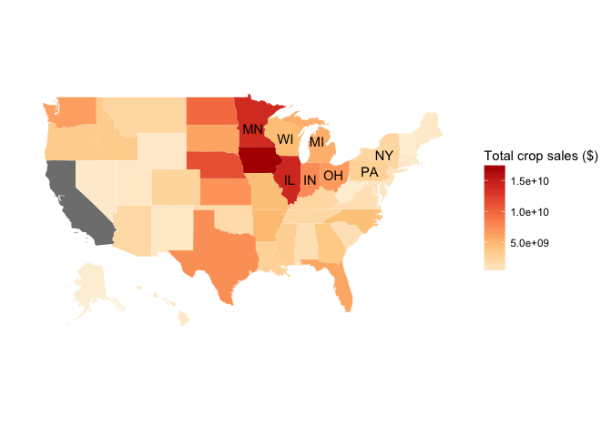

Reproducible output
================
Wenlong
3/26/2018

笔者用过的作图软件比较杂，包括Excel, PowerPoint, Visio, Python 和 R. 其中现在主要用R中的ggplot2在作图。关于ggplot2的用法大家都讨论过很多了，这里笔者主要想讨论一下可重现研究结果 Reproducible research output) 的概念。

现在比较流行的一个趋势是将数据，处理方法和图表结果集合到一个文档中。在Python中有Jupiter Notebook， 在R中有谢大神开发的Knit以及之后的Rmarkdown。尤其是Rmarkdown，结合R studio这款优秀的IDE和tidyverse的数据分析集合工具库，分析数据和展示数据的过程是非常流畅的。这里以刚发出的一个知乎回答为例。 [传送门](https://www.zhihu.com/question/56872143)

那篇回答的大部分图表是可重现的，例如下图就是从[这里](https://www.agcensus.usda.gov/)下载的数据，然后导入到Rmarkdown中，处理完成后直接画出插图。理论上讲，任何人只要安装了相关的软件包，都可以在电脑上得到相同的结果。



如果有朋友感兴趣，可以试着运行一下下面的代码，检验一下是否得到相同的结果，具体的代码和数据可以从[我的GitHub下载](https://github.com/wenlong-liu/wechat_blogs)。

``` r
# Get the map of agricultural crop production of 2012 for all the states in U.S.
crop_total_sale = read_csv("../data/total_crop_sale_us_2012.csv")
# set CA value equals to NA.
crop_total_sale$Value[which(crop_total_sale$State == "CALIFORNIA")] = NA

# set color maps
colors = brewer.pal(5, "OrRd")

crop_total_sale %>% 
  select(State, Year, Commodity, Value) %>% 
  mutate(state = tolower(State)) %>% 
  ggplot(aes(map_id = state)) +
  geom_map(aes(fill = Value), map=fifty_states)+
  expand_limits(x = fifty_states$long, y = fifty_states$lat) +
  coord_map() +
  scale_x_continuous(breaks = NULL) + 
  scale_y_continuous(breaks = NULL) +
  scale_fill_gradientn(name = "Total crop sales ($)",colors = colors)+
  labs(x = "", y = "") +
  geom_text(data = p_lakes,aes(x = long, y = lat, label = State) )+
  theme(legend.position = "right", 
        panel.background = element_blank())+
  coord_fixed(ratio = 1.3)
```

除了这里例子以外，当你的数据量比较大，分发和下载比较麻烦时，可以考虑将数据打包成R package来方便调用(前提是不存在版权问题)。例如前文中用的美国施肥量数据就是集成在一个R package ([usfertilizer](https://cran.r-project.org/web/packages/usfertilizer/index.html))里。感兴趣的用户只需要在R中安装相关包即可方便的获取数据。下边举一个例子，快速的计算出北卡和南卡在1945年到2010年的农田施肥量。

``` r
require(usfertilizer)
require(tidyverse)
data("us_fertilizer_county")

year_plot = seq(1945, 2010, 1)
states = c("NC","SC")

us_fertilizer_county %>% 
  filter(State %in% states & Year %in% year_plot &
           Farm.Type == "farm") %>% 
  group_by(State, Year, Fertilizer) %>% 
  summarise(Quantity = sum(Quantity)) %>% 
  ggplot(aes(x = as.numeric(Year), y = Quantity, color=State)) +
  geom_point() +
  geom_line()+
  scale_x_continuous(name = "Year")+
  scale_y_continuous(name = "Nutrient input quantity (kg)")+
  facet_wrap(~Fertilizer, scales = "free", ncol = 2)+
  ggtitle("Estimated nutrient inputs into arable lands by commercial fertilizer\nfrom 1945 to 2010 in Carolinas")+
  theme_bw()
```


现在笔者基本上写论文和blog都用Rmakrdown来写作，感觉非常方便。如果大家有兴趣可以去继续了解一下：

<https://rmarkdown.rstudio.com/>

<https://www.tidyverse.org/>

<https://yihui.name/cn/>

The end. Thanks for reading.
