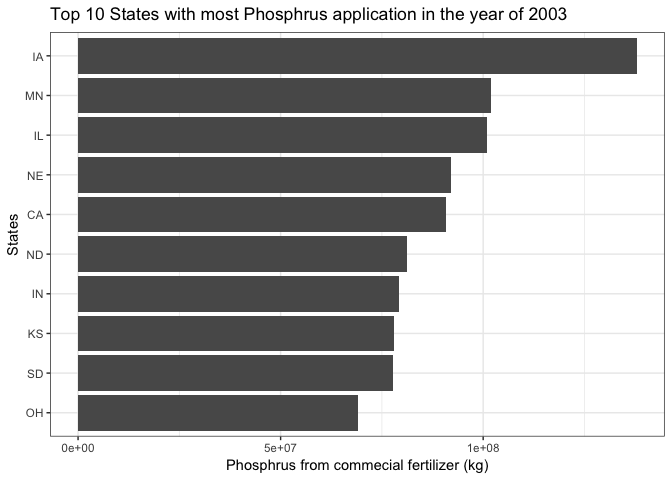

Introduction of TIDY data
================
Wenlong
3/30/2018

记得有一个笑话：**数据分析师的80%的时间，都消耗在数据清理上**。很多时候数据处理不仅仅是效率的问题，有时候甚至没办法进行数据分析的操作。

为了加快数据清理的效率，同时为以后的建模和数据可视化做准备，R语言的Tidyverse包可以提供非常优秀的数据清理、整合和可视化的“一站式服务”。

本文将简单介绍 Tidy 数据的思想以及举例说明使用方法，本文所有的内容均为可重现研究(**Reproducible research**),
请点击 **阅读原文** 获取相关数据及代码。

## Tidy 数据简介 (Tidy data)

为了更好的分析数据，我们需要将数据整合成Tidy格式 (Fig. 1)。 Tidy 格式主要思想是尽量减少不同观测值之间的耦合，以保证：

  - 每行都是一次独立的观测(observation),
  - 每列都是一个独立的变量(variable),
  - 以及每个观测值(values)构成了一个表格。


\[Tidy 数据介绍及图片引自 R for Data Science by Hadley Wickham\]

Tidy 数据也有自己的额外开销(overhead),
例如数据表中可能存在一些重复的数值，浪费了存储空间；不利于矩阵运算来加速计算效率。鉴于现在的电脑技术发展非常迅速，即使存在一些电脑资源的浪费，Tidy
数据对用户更加友好，这些额外开销是可以接受的。

## 安装Tidy

首先安装Tidyverse, 代码如下所示。其实Tidyverse是一系列优秀软件库的合集，其中最常用的几个package包括
dplyr，ggplot2 和 readr 等。

``` r
if (!require(tidyverse)){
  install.packages("tidyverse")
}
```

## 数据清理方法举例

本文的数据来源是美国USGS做的施肥量分析，由于这些数据是通过地理信息系统(GIS)生成的，不太符合Tidy数据的思想，
笔者见简单介绍数据清理的过程。首先读入数据, 原始数据有2M左右，包含110列和3,111行。

``` r
# read in data.
require(tidyverse)

# county level data of fertilizer application.  
#Source: https://www.sciencebase.gov/catalog/item/5851b2d1e4b0f99207c4f238
raw_data = read_csv("../data/CNTY_FERT_1987-2012.csv")
#head(raw_data)
```

### a. 数字前增加一个零

**有些数据前的零会被一些软件自动省略，然而有些数据的位数非常重要**。例如原数据的FIPSno代码就要求是5位数字，所以需要在不够五位数字的前加一个零，代码如下所示：

``` r
# add leading zeros to fill in 5 digits.
raw_data %>% 
  mutate(FIPS_no = str_pad(FIPSno, 5, pad = "0" )) %>% 
  select(FIPS_no)
```

    ## # A tibble: 3,111 x 1
    ##    FIPS_no
    ##    <chr>  
    ##  1 01001  
    ##  2 01003  
    ##  3 01005  
    ##  4 01007  
    ##  5 01009  
    ##  6 01011  
    ##  7 01013  
    ##  8 01015  
    ##  9 01017  
    ## 10 01019  
    ## # ... with 3,101 more rows

## b. 列名里包含变量名

原始数据最大的特点就是列名也包含了数据，例如第7到第10列名称为:“farmN1987” “nonfN1987” “farmN1988”
“nonfN1988”。列名中包括了类别 (farm 与 nonf), 肥料种类(N 与 P)和年份(1987)。

基本步骤是：

  - **移除不需要的信息，**
  - **将所有的施肥量数据放到一列，**
  - **将列名中的数据分离出来。**

<!-- end list -->

``` r
clean_data = raw_data %>%
  # 移除不需要的信息.
  select(-c(FIPS_st, FIPS_co, FIPSno)) %>%
  # 将宽型数据转换成列数据。
  gather(Fert.Type, Quantity, farmN1987:nonfP2012) %>%
  # 将三个变量(variables)分离出来。
  mutate(Year = str_sub(Fert.Type, start = -4), 
         Nutrient = str_sub(Fert.Type, start = -5, end = -5),
         Farm.Type = str_sub(Fert.Type, start = 1, end = 4)
         ) %>%
  # 移除不需要的数据
  select(-Fert.Type) 

head(clean_data)
```

    ## # A tibble: 6 x 7
    ##   FIPS  State County  Quantity Year  Nutrient Farm.Type
    ##   <chr> <chr> <chr>      <int> <chr> <chr>    <chr>    
    ## 1 01001 AL    Autauga  1580225 1987  N        farm     
    ## 2 01003 AL    Baldwin  6524369 1987  N        farm     
    ## 3 01005 AL    Barbour  2412372 1987  N        farm     
    ## 4 01007 AL    Bibb      304592 1987  N        farm     
    ## 5 01009 AL    Blount   1825118 1987  N        farm     
    ## 6 01011 AL    Bullock   767573 1987  N        farm

### c. 根据条件替换变量的数值

到这里，数据已经基本已经满足了Tidy 数据的要求。考虑到农场类型的两个水平为farm 和 nonf,
尤其是nonf容易引起大家的误解，笔者将所有的nonf 替换成
nonfarm.

``` r
clean_data = clean_data %>% 
  # 将 nonf 替换成 nonfarm
  mutate(Farm.Type = ifelse(Farm.Type == "nonf", "nonfarm", "farm"))
# 农场类型已经成功替换成了 nonfarm.
tail(clean_data$Farm.Type)
```

    ## [1] "nonfarm" "nonfarm" "nonfarm" "nonfarm" "nonfarm" "nonfarm"

## 数据可视化举例

整理后的数据可以很方便的进行数据可视化，笔者以ggplot2为例来示范Tidy数据的可视化应用。例如我们可以列出2003年美国磷肥肥施用量最多的10个州，如下图所示。

<!-- -->

## Take-home points

  - Tidy 数据能够方便的处理和展示数据；
  - Tidyverse 是一款非常强大的数据清理、整理与可视化工具；

The end, thanks for reading.

-----


