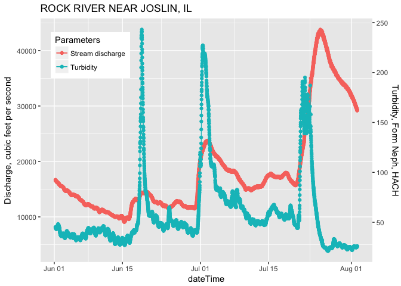

dual y axis
================
Wenlong
5/8/2018

前文中提到一句，R语言中非常流行的ggplot2作图包对双坐标轴的支持很有限，本文就来深入探讨一下这个问题。

## 双坐标轴图的优劣点

对于同一时间轴的多个时间序列数据，ggplot2开发人员鼓励采用**分面**(facet)的做法，即将每个时间数据序列画在不同的小图里。ggplot2的主要作者
**Hadley Wickham** 曾经表示(注：原文为英文，此处为笔者翻译)：

> 在ggplot2中设置不同的坐标轴(不是坐标轴之间的互相转换)是不可行的，因为(Hadely
> Wickham)认为这个做法存在一些问题，包括：

>   - 不同坐标轴的图是**不可回溯**的：如果在图中随意找一个点，读者很难定位到原数据空间；
>   - 这种图有时候会让人无法正确解读；
>   - 这种图更容易**被人为操纵从而误导读者**。因为坐标轴的相对尺度是不唯一的，那么作者可能会人为的操纵数据。
>   - 设置两个坐标轴有时候太随意，为什么不设置三个，四个甚至十个y轴呢？

即使存在一些质疑，水文和环境工作者还是习惯将**水文过程线**(hydrograph)和**溶质变化过程**(chemograph)画到同一张图，从而判断两者之间的关系。

为了制作双坐标轴图，我们可以ggplot2的一个内置函数–*sec\_axis()*–来设置第二个y坐标轴。

## 举例展示双坐标轴图的制作方法

*Sec\_axis()* 函数实质上是将主y坐标轴转换到次坐标轴上，所以作图的重点和难点是*转换公式的设定*。

根据笔者的实践经验，我们可以将**溶质浓度最大值与流量最大值的比值**作为转换系数。

下文将利用USGS的流量(Stream discharge)和浑浊度(Turbidity)的数据来举例说明。

``` r
# import libraries
require(dataRetrieval)
require(ggplot2)
require(dplyr)

# information for usgs stations.
station_Id = "05446500" #Rock River Near Joslin, IL
parameter_code = c("00060", "63680")  # discharge, Turbidity (Form Neph).
start_date = "2017-06-01"
end_date = "2017-08-01"

# retrieve data from usgs.
turbidity_flow = readNWISuv(siteNumbers = station_Id,
                            parameterCd = parameter_code,
                            startDate = start_date,
                            endDate = end_date)
# data cleaning.
turbidity_flow = renameNWISColumns(turbidity_flow)
param_info = attr(turbidity_flow, "variableInfo")
site_info = attr(turbidity_flow, "siteInfo")

# the ratio of maximum solute concentration over maximum flow.
trans_ratio = max(turbidity_flow$.HACH._Turb_Inst, na.rm = TRUE) / 
  max(turbidity_flow$Flow_Inst, na.rm = TRUE)

# plot data
ts = ggplot(turbidity_flow, aes(x = dateTime))+
  geom_point(aes(y = Flow_Inst, color = "Stream discharge"))+
  geom_line(aes(y = Flow_Inst, color = "Stream discharge"))+
  geom_point(aes(y = .HACH._Turb_Inst/trans_ratio, color = "Turbidity"))+
  geom_line(aes(y = .HACH._Turb_Inst/trans_ratio, color = "Turbidity"))+
  scale_y_continuous(name = param_info$variableDescription[1],
                     sec.axis = sec_axis(~.*trans_ratio, name = "Turbidity, Form Neph, HACH"))+
  ggtitle(site_info$station_nm)+
  labs(color = "Parameters")+
  theme(legend.position =  c(0.15, 0.85))

ts
```

<!-- -->

本文的例子仅讨论了最简单的坐标轴转换问题；如果有需要，读者可以自行设置更复杂的转化公式，点击原文即可查看更深入的探讨(英文网页)。

## Take-home points

  - 对于双坐标轴，很多数据科学家有不同的见解；
  - 在水文和环境领域，双坐标轴用处很多；
  - 我们可以设置转换公式来人为获取双坐标轴图。

The end, thanks for reading.

## 相关文章推荐

-----


