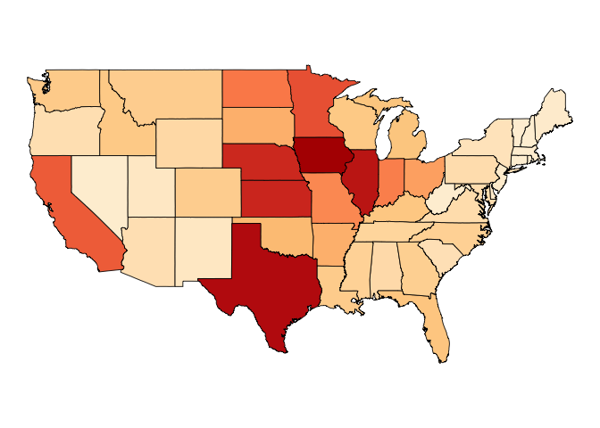

简单三步制作六角贴
================

最近看到y叔介绍的如何制作六角贴(), 有些心动；今天抽时间给笔者开发的R包 *usfertilizer*
定制了一款六角贴，见下图(公众号回复“六角贴”即可收获高清无水印大图)。


其实制作过程非常简单，只需三步即可完成全部制作过程，下文将详细介绍制作过程。

## 1 前期准备工作

首先下载安装R包，如果读者的机器没有安装，可以在输入 *install.package(“package\_name”)* 来安装。

``` r
require(hexSticker)
require(usfertilizer)
require(ggplot2)
require(RColorBrewer)
require(dplyr)
# import fertilizer data.
data("us_fertilizer_county")
```

## 2 设计六角贴的结构

六角贴(hex sticker)一般包括三大部分内容，

  - Logo 名称：可以用笔者设计目标的名称，例如扩展包的名字;
  - 图案：一个简单、直接明了的图案来代表sticker的内容，支持R的基础图，
ggplot2绘图和lattice绘图和自定义绘图;
  - 颜色方案：一套简洁明快的配色方案，具体水平由作者的审美水平决定.

*usfertilizer*是笔者根据现有的数据整理开发的R扩展包，由于包括了美国大陆地区的60多年的施肥量数据，笔者决定用美国各州的某年施肥总量图来做图案。

<!-- -->

## 3\. 制作六角贴

图片选择就绪后，我们可以用*sticker()*函数来完成六角贴的制作，代码如下所示。

``` r
# color theme:https://coolors.co/db5461-175676-000000-087e8b-f48668
sticker(state_plot, 
        package = "usfertilizer", 
        p_size = 8, 
        p_color = "#FFFFFFDD",
        s_x = 1,
        s_y=.75, 
        s_width=1.5, 
        s_height=1.1,
        h_fill = "#087E8B",
        h_color = "#F48668",
        filename="./usfertilizer.png",
        url = "https://github.com/wenlong-liu/usfertilizer",
        u_size = 1)
```

## 收尾工作

如果对代码自动生成的六角贴不太满意，可以自行修改相关的参数来完善，详细的参数介绍可以使用*?sticker*查看。

The end, thanks for reading.

PS:如果对详细代码感兴趣，可以点击*阅读原文*来查看。

-----


